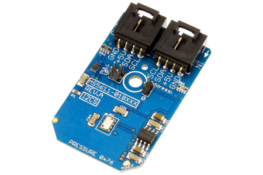

[](https://www.controleverything.com/content/Analog-Digital-Converters?sku=MS5611-01BXXX_I2CS_A01)
# MS5611-01BXXX
MS5611-01BXXX Pressure and Temperature Sensor.

The MS5611-01BXXX device provides a digital 24-bit pressure and temperature value.

This Device is available from ControlEverything.com [SKU: MS5611-01BXXX_I2CS_A01]

https://www.controleverything.com/content/Analog-Digital-Converters?sku=MS5611-01BXXX_I2CS_A01

This Sample code can be used with Raspberry Pi, Arduino and Onion Omega.

## Java
Download and install pi4j library on Raspberry pi. Steps to install pi4j are provided at:

http://pi4j.com/install.html

Download (or git pull) the code in pi.

Compile the java program.
```cpp
$> pi4j MS5611_01BXXX.java
```

Run the java program.
```cpp
$> pi4j MS5611_01BXXX
```

## Python
Download and install smbus library on Raspberry pi. Steps to install smbus are provided at:

https://pypi.python.org/pypi/smbus-cffi/0.5.1

Download (or git pull) the code in pi. Run the program.

```cpp
$> python MS5611_01BXXX.py
```

## Arduino
Download and install Arduino Software (IDE) on your machine. Steps to install Arduino are provided at:

https://www.arduino.cc/en/Main/Software

Download (or git pull) the code and double click the file to run the program.

Compile and upload the code on Arduino IDE and see the output on Serial Monitor.

## Onion Omega

Get Started and setting up the Onion Omega according to steps provided at :

https://wiki.onion.io/Get-Started

To install the Python module, run the following commands:
```cpp
opkg update
```
```cpp
opkg install python-light pyOnionI2C
```

Download (or git pull) the code in Onion Omega. Run the program.

```cpp
$> python MS5611_01BXXX.py
```

#####The code output is the pressure in mbar and temperature reading in degree celsius and fahrenheit.
